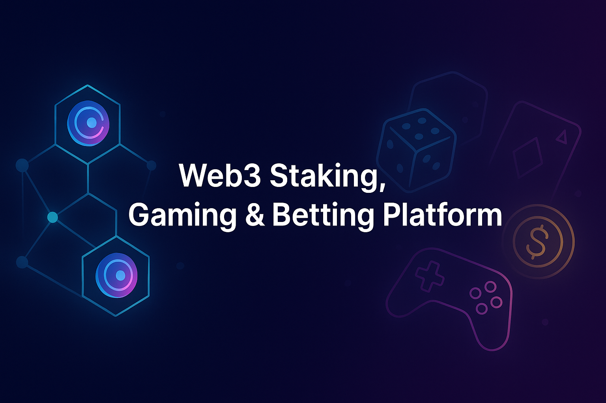
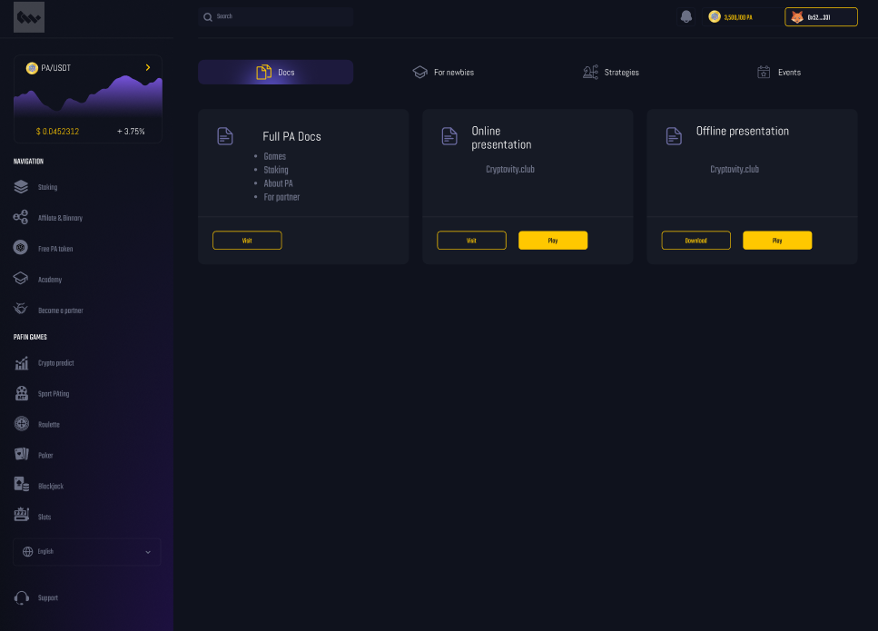
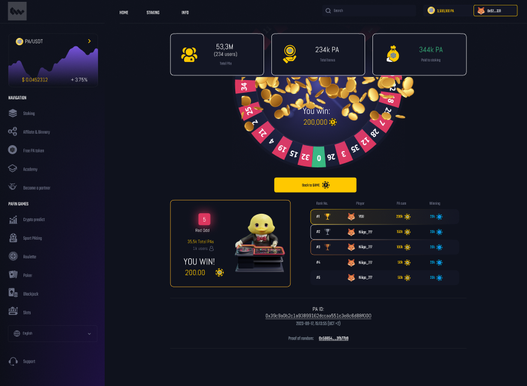

 

## Project Overview
This is a **multi-utility Web3 platform** that integrates staking, casino-style gaming, sports betting, and education into a single blockchain-powered ecosystem.

### Core Features
>✅ **Staking:** Lock PA tokens (and other supported assets) to earn rewards while funding the platform's gaming economy.        
>✅ **Gaming:** Casino-style games like roulette, slots, and prize wheels keep players engaged with quick, excitinh gameplay     
>✅ **Sports Betting:** Covers live and upcoming events, offering competitive odds and multiple bet types.                       
>✅ **Academy:** An interative learning hub teaching Crypto basics, platform mechanics, and risk management to onboard newcomers.

The goal is to create an **all-in-one hub** where players can **play, earn, and learn** without hopping between multiple platforms.

---

## Demo Version
The demo highlights:
>✅ **Staking Dashboard** – Simulated staking with reward tracking.               
>✅ **Mini Games Preview** – Early builds of roulette, slots, and spin-the-wheel.  
>✅ **Sports Betting UI** – Mock-up with odds feeds and betting slip preview.     
>✅ **Academy Hub** – Interactive tutorials and gamified quizzes.                 

**Note:** This demo uses **testnet contracts** and mock data for demonstration. It is **not connected to mainnet or real funds**.

---

## Screenshots & UI Preview

### Staking Dashboard
  
*Lock ChormaWay tokens and monitor rewards in real-time.*

### Game Lobby
  
*Casino-style game previews including roulette, slots, and prize wheel.*

---

## Tech Stack
>✅ **Frontend** – React / Next.js / TailwindCSS              
>✅ **Blockchain** – Solidity / Hardhat / Ethers.js           
>✅ **Backend** – Node.js / TypeScript / PostgreSQL / Redis   
>✅ **Games** – Phaser.js / Unity / WebGL                     
>✅ **Sports Data** – Integrated via 3rd-party APIs           
>✅ **Enterprise Layer** – ChormaWay BCDB middleware          

## Edit a file

You’ll start by editing this README file to learn how to edit a file in Bitbucket.

1. Click **Source** on the left side.
2. Click the README.md link from the list of files.
3. Click the **Edit** button.
4. Delete the following text: *Delete this line to make a change to the README from Bitbucket.*
5. After making your change, click **Commit** and then **Commit** again in the dialog. The commit page will open and you’ll see the change you just made.
6. Go back to the **Source** page.

---

## Create a file

Next, you’ll add a new file to this repository.

1. Click the **New file** button at the top of the **Source** page.
2. Give the file a filename of **contributors.txt**.
3. Enter your name in the empty file space.
4. Click **Commit** and then **Commit** again in the dialog.
5. Go back to the **Source** page.

Before you move on, go ahead and explore the repository. You've already seen the **Source** page, but check out the **Commits**, **Branches**, and **Settings** pages.

---

## Clone a repository

Use these steps to clone from SourceTree, our client for using the repository command-line free. Cloning allows you to work on your files locally. If you don't yet have SourceTree, [download and install first](https://www.sourcetreeapp.com/). If you prefer to clone from the command line, see [Clone a repository](https://confluence.atlassian.com/x/4whODQ).

1. You’ll see the clone button under the **Source** heading. Click that button.
2. Now click **Check out in SourceTree**. You may need to create a SourceTree account or log in.
3. When you see the **Clone New** dialog in SourceTree, update the destination path and name if you’d like to and then click **Clone**.
4. Open the directory you just created to see your repository’s files.

